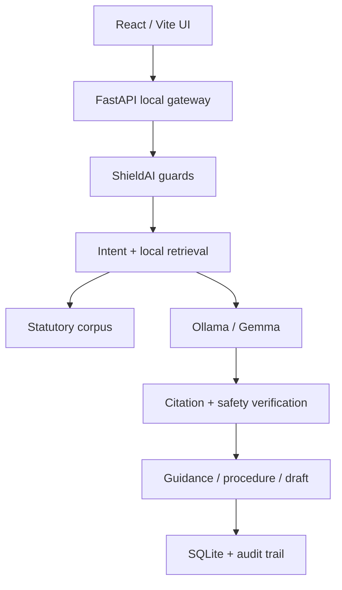

# NyayaBot

NyayaBot is a local-first legal action engine for Indian citizens. It accepts a
problem in English, Hindi, or Hinglish; masks configured personal identifiers;
retrieves relevant provisions from a local corpus; asks a locally running Gemma
model for grounded guidance; verifies the output; and turns the result into a
resumable procedure or fact-bound document.

This repository is the completed, runnable MVP based on the original VerifAI
hackathon concept. It is designed to be honest and inspectable: the core
workflow runs without a cloud API, while optional heavy components have explicit
fallbacks and limitations.

## What works

- Responsive React/Vite interface with dashboard, case creation, workspace,
  research, action guides, drafting, and trust-report screens
- FastAPI local gateway; the browser never calls Ollama directly
- 13 legal-domain tables plus schema version, procedure state, and idempotency
- Unit of Work transactions and SQL-level compare-and-swap concurrency
- Tombstone deletion with append-only domain and audit events
- Hierarchical offline retrieval: rank relevant Acts, then their sections
- Ollama integration with a configurable local Gemma model
- Deterministic corpus-grounded fallback when Ollama is not installed
- Hinglish-oriented intent detection and multilingual prompting
- ShieldAI PII masking, injection checks, disclaimer enforcement, and citation
  grounding report
- Resumable consumer, RTI, and police-complaint procedure checklists
- Legal notice, police complaint, RTI, and consumer complaint drafts
- Local PDF export
- Evidence metadata and plain-text extraction
- Reusable dependency-free `packages/shieldai` package
- Backend tests, production frontend build, Docker files, and GitHub Actions CI

## Important limitations

NyayaBot provides general legal information, not legal advice. The included
legal corpus is a compact demonstration dataset and must be expanded and
lawyer-reviewed before real-world use. State-specific rent laws, current rules,
fees, deadlines, court directories, and source text must be independently
verified.

Image/PDF evidence is safely recorded, but automatic vision extraction requires
connecting a local vision-capable model or OCR adapter. ChromaDB and multilingual
sentence-transformer dependencies are left as an upgrade path; the repository
ships with a fully offline TF-IDF retriever so a new contributor can run it
without downloading another model.

The original slides use the name “Gemma 4.” The runnable default is configured
as `gemma3:4b`, a practical Ollama model tag. Set `NYAYABOT_OLLAMA_MODEL` to the
exact locally installed model you want to use.

## Architecture



See [docs/ARCHITECTURE.md](docs/ARCHITECTURE.md) for the full boundary and
persistence design.

## Tech stack

| Layer | Technology |
|---|---|
| Frontend | React 18, TypeScript, Vite, React Router, Lucide |
| Local API | Python 3.12, FastAPI, Pydantic, Uvicorn |
| Model runtime | Ollama with configurable Gemma model |
| Retrieval | Hierarchical TF-IDF fallback; ChromaDB adapter-ready |
| Persistence | SQLite, WAL mode, foreign keys, CAS, Unit of Work |
| Safety | ShieldAI input/output guardrails |
| Documents | ReportLab PDF generation |
| Testing / CI | Pytest, TypeScript build, GitHub Actions |

## Quick start

Prerequisites:

- Python 3.12+
- Node.js 20+
- Optional: Ollama and a locally downloaded Gemma model

### Windows

```powershell
.\scripts\setup.ps1

# Terminal 1
.\.venv\Scripts\python.exe backend\run.py

# Terminal 2
npm --prefix frontend run dev
```

### macOS / Linux

```bash
chmod +x scripts/*.sh
./scripts/dev.sh
```

Open `http://127.0.0.1:5173`. API documentation is at
`http://127.0.0.1:8000/docs`.

### Enable local Gemma

```bash
ollama pull gemma3:4b
ollama serve
```

If your installed model has a different tag:

```bash
export NYAYABOT_OLLAMA_MODEL=your-local-model-tag
```

The health indicator in the top bar changes from **Safe fallback mode** to
**Gemma connected**.

## Test

```bash
cd backend
../.venv/bin/pytest -q

cd ../frontend
npm run build
```

## Repository structure

```text
nyayabot/
├── backend/
│   ├── app/
│   │   ├── services/       # RAG, Ollama, ShieldAI, drafting, procedures
│   │   ├── database.py     # schema, migrations, Unit of Work
│   │   ├── repositories.py # CAS, idempotency, tombstone policy
│   │   └── main.py         # local REST API
│   ├── data/               # small reviewed demo corpus/templates
│   └── tests/
├── frontend/
│   └── src/                # connected React application
├── packages/shieldai/      # reusable model-agnostic guardrails
├── docs/
├── scripts/
└── .github/workflows/ci.yml
```

## Push to GitHub

After extracting the folder:

```bash
cd nyayabot
git init
git add .
git commit -m "Build NyayaBot local-first legal action engine"
git branch -M main
git remote add origin https://github.com/YOUR_USERNAME/NyayaBot.git
git push -u origin main
```

## Security and privacy

- Bind the API to `127.0.0.1` unless remote LAN access is intentional.
- Do not commit `data/`, `.env`, generated PDFs, or case databases.
- Treat OCR text and generated drafts as untrusted until a person reviews them.
- Use SQLCipher or encrypted storage for sensitive deployments.
- Replace the demo corpus with versioned, authoritative, jurisdiction-specific
  material before public deployment.

## Author

Shubhi Dixit
B.Tech, Computer Science Engineering
Delhi Technological University
