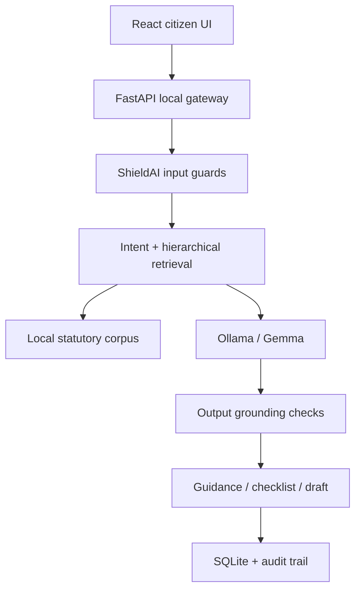

# Architecture

## Runtime boundary

The normal local deployment uses:

- React at `127.0.0.1:5173`
- NyayaBot API at `127.0.0.1:8000`
- Ollama at `127.0.0.1:11434`
- SQLite and generated PDFs inside `./data`

The browser never calls Ollama directly. This prevents the CORS, mixed-content,
and direct-model-exposure problems in the original cloud-UI concept. The local
API constructs prompts, retrieves sources, applies guardrails, and owns all
case writes.

## Persistence invariants

- Foreign keys are enabled on every connection.
- Case updates use `UPDATE ... WHERE revision = ?`.
- A stale revision raises a conflict instead of overwriting a newer write.
- Multi-record application writes run inside a Unit of Work transaction.
- Deletion is a tombstone plus `CaseDeleted` and immutable audit events.
- Idempotency keys replay the first stored response.
- Statutory corpus JSON is application-owned and never modified through the API.

## Retrieval

The included corpus is deliberately small and clearly marked as demo data.
Retrieval uses a dependency-free hierarchical TF-IDF implementation:

1. score Acts against the query;
2. boost the top matching Acts;
3. rank individual sections;
4. provide the selected text and source metadata to the local model.

The `LegalCorpus.search()` contract is intentionally small so it can be replaced
with ChromaDB and a local multilingual embedding model without changing routes
or frontend code.

## Safe fallback

Ollama is optional at startup. When unavailable, NyayaBot produces a constrained
extractive response from retrieved corpus entries. This makes the full case,
retrieval, checklist, drafting, and trust-report workflow demonstrable on a
machine that has not yet downloaded a multi-gigabyte model.
